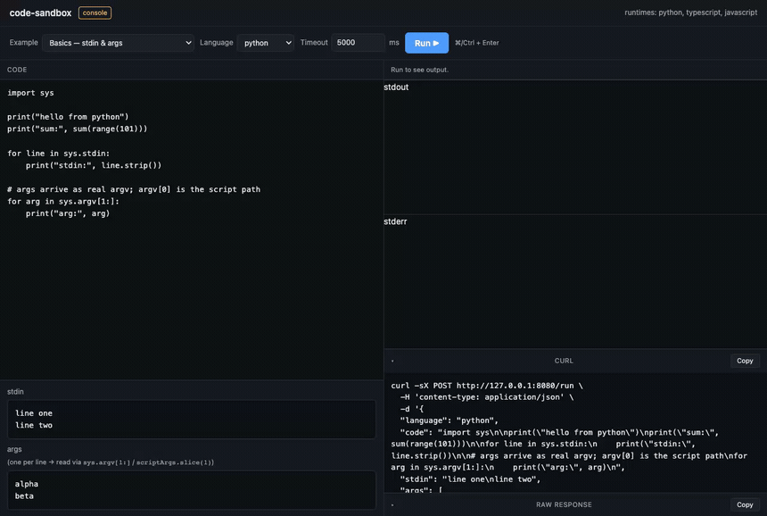

# code-sandbox

Run untrusted **Python** and **TypeScript/JavaScript** through a simple HTTP API.
Code executes inside a **wasmtime** WebAssembly sandbox — no host filesystem, no
network, no processes, with hard memory and time limits — and you get back
`stdout`, `stderr`, and the exit code.



> The built-in browser console running code and watching the sandbox block
> filesystem, network, shell, and resource-exhaustion attacks — live.
> Full-quality video: [MP4](recordings/console-demo.mp4) · [WebM](recordings/console-demo.webm)

## What you get

- **Two language families** — Python (via CPython) and JavaScript/TypeScript (via
  QuickJS), both running *inside* wasm.
- **Locked down by default** — untrusted code can't reach the host, the network,
  or other runs, and can't exhaust the machine. [See exactly what's blocked ↓](#security)
- **Fast** — runtimes are compiled once and kept warm; each run adds only
  microseconds, not container-boot seconds.
- **A browser playground** at `/console` with ready-made examples and
  copy-as-cURL.
- **Dead-simple API** — one `POST /run` call.

## Quick start

Requires macOS with [Homebrew](https://brew.sh); everything else is bootstrapped
for you.

```bash
make init        # one-time: install toolchain (Rust, cmake), build wasm runtimes, compile
make console     # run with the browser playground enabled
```

Open **http://127.0.0.1:8080/console**, pick an example (or write your own), and
hit Run (⌘/Ctrl+Enter). Stop the server with `make stop`. Run `make help` for all
targets.

### Common targets

| Target | What it does |
|--------|--------------|
| `make init` | One-time dev-env setup: toolchain + runtimes + build |
| `make console` | Run with the `/console` playground enabled (dev only) |
| `make run` | Run the server without the console |
| `make stop` | Stop a running server |
| `make release` | Optimized release build |
| `make py-deps PKG="humanize jinja2"` | Add pure-Python packages available to sandboxed code |
| `make test` / `make fmt` / `make clippy` | Test / format / lint |

Env vars: `BIND` (default `127.0.0.1:8080`), `PYTHON_WASM`, `QJS_WASM` (override
runtime paths), `PY_PACKAGES` (dir of pure-Python packages; default
`runtimes/py-site-packages`), `CONSOLE` (enables `/console`).

> The `/console` playground is **off by default** and only mounts when the server
> is started with `CONSOLE=1` (what `make console` does) — so it can't be deployed
> by accident. Keep it disabled in production.

## Using the API

### `POST /run`

```jsonc
{
  "language": "python" | "typescript" | "javascript",
  "code": "print('hi')",
  "stdin": "optional input",      // piped to the program's stdin
  "args": ["optional", "argv"],   // real argv: Python sys.argv[1:], JS scriptArgs.slice(1)
  "timeout_ms": 5000              // clamped to the server max (30s)
}
```

Response:

```jsonc
{
  "stdout": "hi\n",
  "stderr": "",
  "exit_code": 0,        // null if trapped or timed out
  "duration_ms": 26,
  "timed_out": false,
  "trapped": false,      // e.g. hit the memory cap
  "error": null          // set when a run never started (e.g. a TS compile error)
}
```

`GET /languages` lists the loaded runtimes; `GET /health` is a liveness check.

### Examples

```bash
# Python: read stdin, print a result
curl -sX POST localhost:8080/run -H 'content-type: application/json' -d '{
  "language":"python","code":"import sys;print(sum(int(x) for x in sys.stdin.split()))","stdin":"1 2 3 4"
}'
# {"stdout":"10\n","exit_code":0,...}

# TypeScript: types are stripped, then it runs
curl -sX POST localhost:8080/run -H 'content-type: application/json' -d '{
  "language":"typescript","code":"enum E{A,B};const x:number=E.B;console.log(x)"
}'
# {"stdout":"1\n",...}
```

> Tip: in the console, type code in the editor and copy the generated `curl`
> command from the **cURL** panel.

## Security

Untrusted code runs with **no host filesystem, no network, no processes, no
native-code FFI**, and hard limits on time and memory. Every control below is
verified — and runnable one-click from the console's 🔒 examples:

| Attack | What the sandbox does |
|--------|-----------------------|
| Read a host file (`/etc/passwd`) | `FileNotFoundError` — host FS not mounted |
| Open a socket / `fetch` | `OSError: Not supported` / `fetch` undefined — no network |
| Write to its own code dir | `PermissionError` — code dir mounted read-only |
| Run a shell / spawn a process (`os.system`, `subprocess`) | *"wasi does not support processes"* — no process model |
| Call native code (`ctypes`, libc) | `ModuleNotFoundError` — no FFI compiled in |
| Read host env vars (`os.environ`) | sees only vars the host passes — no `HOME`/`PATH`/secrets |
| Infinite loop (CPU exhaustion) | killed at the wall-clock deadline (epoch interruption) |
| Memory bomb (`bytearray(400MB)`) | `MemoryError` — capped by `StoreLimits` |

These span two goals, both enforced by the wasm boundary: **isolation** (can't
read, reach, or escape — protecting confidentiality & integrity) and **resource
limits** (can't exhaust CPU/memory — protecting availability against DoS). The
guarantees hold because WASI has no syscalls for the forbidden operations and
wasmtime only grants the capabilities we hand it — the boundary is a *missing
capability*, not a filter that could be bypassed.

## Languages & packages

| Language | Runs as | Packages |
|----------|---------|----------|
| Python | CPython compiled to `wasm32-wasi` | Pure-Python only, via `make py-deps` |
| JavaScript | QuickJS compiled to `wasm32-wasi` | Bundle pure-JS to one file, then submit |
| TypeScript | Types stripped/lowered host-side (swc), then run as JS in QuickJS | same as JS |

Add **pure-Python** packages to a shared, read-only dir that's mounted into every
Python run:

```bash
make py-deps PKG="humanize jinja2"      # -> runtimes/py-site-packages/
```

```bash
curl -sX POST localhost:8080/run -H 'content-type: application/json' -d '{
  "language":"python","code":"import humanize;print(humanize.naturalsize(12345678))"
}'   # {"stdout":"12.3 MB\n",...}
```

> **Native-extension packages (numpy, pandas, native npm addons) do not work** on
> this tier — they'd need `wasm32-wasi` builds, which barely exist today. Pure
> compute + pure-Python/JS libraries is the sweet spot. Feature-complete
> Python/Node with native packages is a separate, heavier runtime tier
> (Firecracker/gVisor) — see the roadmap.

## How it works

wasmtime is a great fit for **pure compute** (stdin/args in, stdout/stderr out):

- **Capability-based isolation** — a guest can only touch what the host grants.
  We grant one read-only dir (the user's code) and nothing else.
- **Deterministic limits** — linear-memory cap via `StoreLimits`; wall-clock
  timeout via epoch interruption.
- **Warm by design** — modules are compiled once at startup and reused, so each
  request is just a fresh `Store` + instance.

```
HTTP client ──▶ axum ──▶ spawn_blocking ──▶ Sandbox::execute
                                              │
                                              ├─ pick precompiled Module (warm)
                                              ├─ fresh Store + StoreLimits (mem cap)
                                              ├─ WASI ctx: ro /sandbox, captured
                                              │  stdout/stderr, optional stdin
                                              ├─ epoch watchdog thread (timeout)
                                              └─ instantiate + call _start
```

Source layout: `src/api.rs` (request/response types) · `src/runtime.rs` (the
wasmtime engine: limits, isolation, timeout) · `src/transpile.rs` (TS→JS,
host-side) · `src/main.rs` (axum server).

> TypeScript transpilation is a **trusted, host-side** step — it only parses and
> strips/lowers types, never executes user code. The emitted JS is what runs in
> the sandbox.

## Roadmap — iteration 2: Kubernetes warm pods

This local build is iteration 1. The key idea — *pay compile/startup cost once,
keep it warm, do only per-run work on the hot path* — scales out to a pool of
pre-warmed executor pods:

```
                    ┌─────────────┐
   client ───▶ API / Dispatcher ──┼─▶ picks an idle warm pod, sends the job
                    └─────────────┘        │
                          ▲                ▼
                    Pool Manager     ┌──────────────┐   ┌──────────────┐
                    (keeps N idle    │ Executor Pod │   │ Executor Pod │  ...
                     pods per lang   │  (this bin)  │   │  (this bin)  │
                     warm; scales    │ modules warm │   │ modules warm │
                     on demand)      └──────────────┘   └──────────────┘
```

- **Warm pod** = a pod already running this executor with the wasm modules
  resident, so a job is just an HTTP/gRPC call to `/run` — no cold start.
- **Pool Manager** keeps N idle pods per language warm and scales on a
  pending-jobs metric (scale to zero when idle).
- **Pod hardening** as defense-in-depth around the wasm sandbox: non-root,
  read-only rootfs, dropped capabilities, seccomp, no-egress NetworkPolicy.
- **Second tier** for native packages: route numpy/pandas/full-Node workloads to
  Firecracker microVMs / gVisor containers instead of wasm.

Planned: CPU fuel metering · `Module::serialize` cache baked into the image ·
gRPC executor + dispatcher · Pool Manager controller + Helm chart · per-tenant
quotas, auth, and audit logging.
